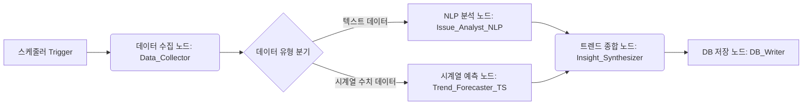

## 🌍 글로벌 트렌드 분석 및 예측 엔진 아키텍처

### 1. 개요

이 문서는 `trend_analysis` 도메인에서 동작하는 **글로벌 트렌드 분석 및 예측 엔진**의 역할과 워크플로우, 기술 스택을 정의합니다.  
`user` 도메인의 대화형 에이전트가 **“사용자와 소통하는 프론트엔드 직원”**이라면, 이 엔진은 **“백엔드에서 데이터를 씹어먹고 분석하는 연구소”**에 해당합니다.

- **목표**: 외부 데이터 소스(뉴스, 정책, 투자, 검색량 등)를 주기적으로 수집·분석하여 `EXTERNAL_TREND_DATA` 등 트렌드 관련 테이블에 **정제된 지표와 인사이트를 저장**하는 것
- **특징**:
  - 사용자의 질문에 맞춰 반응하는 챗봇이 아니라, **스케줄러에 의해 자동 실행되는 배치 파이프라인**
  - 텍스트(뉴스/정책) + 수치(투자금, 검색량) 등 **멀티모달 데이터**를 동시에 처리
  - 최종 산출물은 `Trend_Analyst`/`Insight_Coach` 등 **사용자 에이전트가 소비하는 데이터 레이어**

---

### 2. 아키텍처 개요: DAG 기반 데이터 파이프라인

`user` 에이전트는 LangGraph **스타 토폴로지(Orchestrator-Worker)** 구조를 사용하지만,  
트렌드 분석 엔진은 **데이터가 한 방향으로 흐르는 배치 파이프라인**이므로 **DAG(Directed Acyclic Graph)** 구조가 적합합니다.

- **실행 방식**:  
  - 예: 매일 새벽 03:00에 스케줄러(Crontab, Airflow, FastAPI BackgroundTask + 외부 스케줄러 등)에서 트리거
  - 한 번 실행 시, **전 단계가 성공해야 다음 단계로 진행**하는 순차 워크플로우
- **주요 단계**:
  1. **수집(Ingestion)**: 외부 API/RSS 등에서 원천 데이터 수집
  2. **분석(Analysis)**: 텍스트 분석(NLP) + 수치 예측(Time-Series)
  3. **종합 및 저장(Synthesis & Storage)**: 인사이트 생성 후 DB 적재

#### 2.1. 전체 파이프라인 조감도



---

### 3. 노드별 역할 정의

RTX 4070 Super (12GB) 환경에서, 이 파이프라인은 **사용자 트래픽이 적은 시간대(예: 새벽)**에 주기적으로 실행되는 것을 기본 전제로 합니다.

| 단계 | 노드명 | 역할 | 사용 모델/기술 | 비고 |
|------|--------|------|----------------|------|
| 1 | `Data_Collector` | 외부 데이터 소스 수집 | Python 스크립트 (`requests`, `feedparser`, `BeautifulSoup` 등) | LLM 불필요 |
| 2A | `Issue_Analyst_NLP` | 텍스트 데이터 요약·키워드·감성 분석 | Llama-3.1-8B (Local, QLoRA) | NLP 파이프라인 |
| 2B | `Trend_Forecaster_TS` | 시계열 수치 데이터의 미래 Velocity Score 예측 | GRU 또는 Time-Series Transformer | 별도 학습 모델 |
| 3A | `Insight_Synthesizer` | 정성·정량 결과를 결합한 인사이트 문장 생성 | Llama-3.1-70B (Groq) 또는 8B(Local) | 고품질 자연어 인사이트 |
| 3B | `DB_Writer` | 최종 결과를 DB 테이블에 Insert/Update | SQLAlchemy + Async 세션 | `EXTERNAL_TREND_DATA` 등 |

---

### 4. 1단계: 데이터 수집 (Data Ingestion)

#### 4.1. `Data_Collector` 노드

- **역할**:
  - 프로젝트의 `docs/DATA_STRATEGY.md`에서 정의한 **5대 선행 지표** 소스에서 전일(based on UTC/KST) 데이터를 가져옵니다.
    - 돈의 흐름: VC/벤처투자 API, 스타트업 뉴스 RSS 등
    - 혁신의 흐름: 특허 API(KIPRIS 등)
    - 역량의 흐름: 검색량/강의 랭킹/도서 판매 데이터
    - 거시/정책: 중앙은행, 정부 부처 RSS 등
  - 텍스트/수치 데이터를 **Raw 형태로 저장** (`raw_trend_logs` 또는 파일/객체 스토리지)

- **기술 스택**:
  - Python + `requests`, `feedparser`, `BeautifulSoup` 등
  - 필요 시, 간단한 **리트라이/백오프 로직** 포함

- **출력 형태 예시**:
  - 텍스트 데이터:
    - 기사 제목, 본문, 출처, 카테고리, 발행일시
  - 수치 데이터:
    - 날짜별 투자액, 검색량, 특허 출원 수 등 (Time-Series 포맷)

- **주의사항**:
  - API Rate Limit 고려
  - 동일 데이터 중복 수집 방지(날짜+소스 기준 dedup)

---

### 5. 2단계: 병렬 분석 (Parallel Analysis)

Data_Collector의 결과는 **텍스트 트랙(A)**과 **수치 트랙(B)**으로 분기됩니다.

#### 5.1. 트랙 A: 텍스트 분석 (`Issue_Analyst_NLP`)

- **역할**:
  - 수집된 뉴스/보고서 등 텍스트 데이터를 입력으로 받아:
    - 핵심 이슈 요약 (Top-K 키포인트)
    - 주요 키워드/주제 추출
    - 감성 분석(긍정/부정/중립, 0~1 스코어)

- **모델**:
  - **Llama-3.1-8B-Korean-Bllossom (Local, QLoRA 튜닝 가능)**
  - RTX 4070 12GB 환경에서 4-bit QLoRA로 적재

- **튜닝 포인트**:
  - 우리 도메인에 특화된 프롬프트/예시:
    - 예:  
      *“다음 뉴스들을 읽고 '생성형 AI' 트렌드에 대한 주요 이슈 3가지와 시장 분위기(감성 점수)를 요약해줘.”*
  - 뉴스 헤드라인/본문 →  
    - `issues: [..]`, `sentiment_score: float`, `keywords: [..]` 형태 JSON 출력에 특화

- **출력 예시(JSON)**:
```json
{
  "trend_topic": "생성형 AI 보안",
  "top_issues": [
    "기업용 LLM 보안 솔루션 투자 증가",
    "데이터 프라이버시 규제 강화",
    "AI 생성 콘텐츠 검증 도구 등장"
  ],
  "keywords": ["LLM Security", "Data Privacy", "Content Verification"],
  "sentiment_score": 0.72
}
```

#### 5.2. 트랙 B: 수치 예측 (`Trend_Forecaster_TS`)

- **역할**:
  - 과거 N일 간의 Time-Series 데이터(투자금, 검색량, 특허 수 등)를 바탕으로
  - 향후 M일 간의 **Velocity Score** 변화량을 예측

- **모델**:
  - **GRU 또는 Time-Series Transformer** 기반 별도 PyTorch/TF 모델
  - LLM이 아닌, 순수 시계열 예측 전용 모델 (경량 + 정확도)

- **입력 예시**:
  - 각 지표별 \[t-28, ..., t-1\] 구간의 정규화된 값

- **출력 예시**:
```json
{
  "trend_topic": "생성형 AI 보안",
  "predicted_velocity_score": 0.84,
  "confidence_interval": [0.78, 0.90],
  "horizon_days": 28
}
```

---

### 6. 3단계: 종합 및 저장 (Synthesis & Storage)

#### 6.1. `Insight_Synthesizer`

- **역할**:
  - 트랙 A의 **정성 분석 결과(현재 이슈/분위기)**와  
    트랙 B의 **정량 예측 결과(미래 Velocity Score)**를 결합하여
  - 하나의 **“일일 트렌드 리포트” 텍스트**를 생성

- **모델**:
  - **Llama-3.1-70B (Groq API)** 권장  
    - 고품질 자연어 설명과 전략적 인사이트가 중요
  - 리소스가 제한적인 경우 로컬 8B로 대체 가능

- **프롬프트 예시(요지)**:
> “투자가 지난달 대비 30% 늘었고(수치), 관련하여 'LLM 보안 솔루션' 뉴스가 급증했다(텍스트).  
> 이를 바탕으로 이 트렌드의 현재 상황과 미래 전망을 한 문단으로 정리해줘.”

- **출력 예시**:
```json
{
  "trend_topic": "생성형 AI 보안",
  "narrative": "지난 한 달간 생성형 AI 보안 분야에 대한 투자가 뚜렷하게 증가했으며, 특히 기업용 LLM 보안 솔루션에 대한 관심이 커지고 있습니다. ...",
  "opportunity_level": "HIGH"
}
```

#### 6.2. `DB_Writer`

- **역할**:
  - `Issue_Analyst_NLP`, `Trend_Forecaster_TS`, `Insight_Synthesizer`의 출력을 결합하여
  - `EXTERNAL_TREND_DATA` 등 트렌드 관련 테이블에 Insert/Update

- **DB 스키마 예시(개념)**:
  - `trend_name`, `category`, `velocity_score`, `sentiment_score`,  
    `opportunity_level`, `summary`, `raw_meta`(JSONB) 등

- **기술 스택**:
  - SQLAlchemy Async (`AsyncSessionLocal`)
  - 트랜잭션 단위로 커밋/롤백 관리

---

### 7. 사용자 에이전트와의 관계

이 트렌드 분석 엔진은 **프로듀서(Producer)**,  
`user` 도메인의 LangGraph 에이전트(특히 `Trend_Analyst`, `Insight_Coach` 노드)는 **컨슈머(Consumer)** 역할을 합니다.

| 역할 | 주체 | DB와의 관계 | 비유 |
|------|------|-------------|------|
| **생산자** | 트렌드 분석 엔진 (`trend_analysis` 도메인) | 매일 밤 새로운 트렌드 분석 데이터를 DB에 **채워 넣음** | 식당 주방에서 재료를 손질하고 요리를 미리 준비하는 셰프 |
| **소비자** | 사용자 에이전트 (`user` 도메인) | 사용자가 질문할 때 DB에서 최신 데이터를 **꺼내 씀** | 손님 주문이 들어오면 준비된 요리를 서빙하는 웨이터 |

- `user/docs/AGENT_ARCHITECTURE.md`의 `Trend_Analyst` 노드는  
  이 엔진이 채워 넣은 `EXTERNAL_TREND_DATA`를 SQL로 조회하여 사용자에게 설명합니다.
- `Insight_Coach` 노드는 사용자 `persona_vector` + `user_competency` + 이 엔진의 결과를 조합하여  
  **“나에게 맞는 트렌드/로드맵”**을 만들어냅니다.

---

### 8. 리소스 전략 (RTX 4070 Super 12GB 기준)

- **배치 실행 시간대**:
  - 프론트 사용자 트래픽이 낮은 시간대(예: 새벽 03:00)에 파이프라인 실행
- **모델 운용 전략**:
  - 로컬 8B 모델은 QLoRA(4-bit)로 로드하여 VRAM 5~6GB 내로 운영
  - 시계열 모델(GRU/Transformer)은 상대적으로 경량
  - 고품질 자연어 인사이트가 필요한 구간만 Groq 70B API 호출
- **장점**:
  - 사용자 대화형 에이전트와 GPU 리소스를 경쟁시키지 않음
  - 트렌드 엔진은 배치 작업이므로, 실패 시 재시도/재실행 전략 수립이 용이

---

### 9. 다음 단계 제안

1. **최소 기능 파이프라인(MVP) 정의**
   - 가장 수집·파싱이 쉬운 소스 1개 선택 (예: 특정 뉴스 RSS 또는 Google Trends 한 카테고리)
   - `Data_Collector → Issue_Analyst_NLP → DB_Writer`의 3단계 미니 파이프라인부터 구현

2. **스키마 정교화**
   - `EXTERNAL_TREND_DATA` 및 관련 테이블의 컬럼/인덱스 설계 보완 (`docs/DB_SCHEMA.md`와 연동)

3. **LangGraph로 DAG 정의 여부 검토**
   - 단순 배치라면 Python 스크립트 + 스케줄러만으로도 충분
   - 중간 재시도·분기·모니터링 요구가 늘어나면 LangGraph/Orchestrator 도입 검토

이 문서는 `trend_analysis` 도메인의 구현 기준점이 되는 상위 설계서로,  
구현이 진행되면서 `agent/`, `service/`, `model/` 구조와 함께 지속적으로 업데이트하는 것을 권장합니다.

