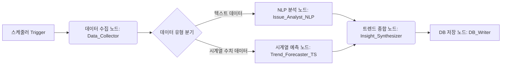

## 🇰🇷 한국 트렌드 분석 및 예측 엔진 아키텍처

### 1. 개요

이 문서는 `trend_analysis` 도메인에서 동작하는 **한국 트렌드 분석 및 예측 엔진**의 역할과 워크플로우, 기술 스택을 정의합니다.  
`user` 도메인의 대화형 에이전트가 **"사용자와 소통하는 프론트엔드 직원"**이라면, 이 엔진은 **"백엔드에서 데이터를 씹어먹고 분석하는 연구소"**에 해당합니다.

- **목표**: 한국 시장 중심의 외부 데이터 소스(뉴스, 정책, 투자, 검색량 등)를 주기적으로 수집·분석하여 `EXTERNAL_TREND_DATA` 등 트렌드 관련 테이블에 **정제된 지표와 인사이트를 저장**하는 것
- **특징**:
  - 사용자의 질문에 맞춰 반응하는 챗봇이 아니라, **스케줄러에 의해 자동 실행되는 배치 파이프라인**
  - 텍스트(뉴스/정책) + 수치(투자금, 검색량) 등 **멀티모달 데이터**를 동시에 처리
  - 최종 산출물은 `Trend_Analyst`/`Insight_Coach` 등 **사용자 에이전트가 소비하는 데이터 레이어**

#### 1.1. 한국 트렌드 분석으로의 전환 배경

초기 설계에서는 **글로벌 트렌드 분석**을 목표로 했으나, 실제 데이터 수집 과정에서 다음과 같은 제약사항을 발견했습니다:

- **글로벌 API 접근성 문제**:
  - 대부분의 글로벌 데이터 소스(예: Crunchbase, Bloomberg, LinkedIn 등)는 **유료 API**를 요구하거나 **무료 티어의 Rate Limit이 매우 제한적**
  - 지역별 데이터 접근 제한(예: 일부 API는 특정 국가 IP 차단)
  - API 키 발급 및 인증 프로세스의 복잡성

- **한국 시장 특화 데이터의 필요성**:
  - 한국 사용자에게는 **국내 시장 트렌드**가 더 실용적이고 즉시 활용 가능
  - 한국어 데이터 소스(뉴스, 채용 공고, 검색 트렌드)의 품질과 접근성이 우수
  - 한국 정부/공공기관의 **무료 공개 API** 활용 가능(예: KIPRIS, 기획재정부, Naver DataLab)

- **데이터 수집 효율성**:
  - 한국 중심 데이터 소스는 **RSS 피드, 웹 스크래핑, 공개 API** 등 다양한 방식으로 접근 가능
  - 언어 일관성(한국어)으로 인한 NLP 처리 품질 향상
  - 초기 MVP 구축 시 **빠른 프로토타이핑** 가능

따라서 본 엔진은 **한국 트렌드 분석 및 예측**에 집중하며, 필요 시 선택적으로 글로벌 소스(예: GitHub, arXiv 등 접근성이 좋은 소스)를 보조적으로 활용합니다.

---

### 2. 아키텍처 개요: DAG 기반 데이터 파이프라인

`user` 에이전트는 LangGraph **스타 토폴로지(Orchestrator-Worker)** 구조를 사용하지만,  
트렌드 분석 엔진은 **데이터가 한 방향으로 흐르는 배치 파이프라인**이므로 **DAG(Directed Acyclic Graph)** 구조가 적합합니다.

- **실행 방식**:  
  - 예: 매일 새벽 03:00에 스케줄러(Crontab, Airflow, FastAPI BackgroundTask + 외부 스케줄러 등)에서 트리거
  - 한 번 실행 시, **전 단계가 성공해야 다음 단계로 진행**하는 순차 워크플로우
- **주요 단계**:
  1. **수집(Ingestion)**: 외부 API/RSS 등에서 원천 데이터 수집
  2. **분석(Analysis)**: 텍스트 분석(NLP) + 수치 예측(Time-Series)
  3. **종합 및 저장(Synthesis & Storage)**: 인사이트 생성 후 DB 적재

#### 2.1. 전체 파이프라인 조감도



---

### 3. 노드별 역할 정의

RTX 4070 Super (12GB) 환경에서, 이 파이프라인은 **사용자 트래픽이 적은 시간대(예: 새벽)**에 주기적으로 실행되는 것을 기본 전제로 합니다.

| 단계 | 노드명 | 역할 | 사용 모델/기술 | 비고 |
|------|--------|------|----------------|------|
| 1 | `Data_Collector` | 외부 데이터 소스 수집 | Python 스크립트 (`requests`, `feedparser`, `BeautifulSoup` 등) | LLM 불필요 |
| 2A | `Issue_Analyst_NLP` | 텍스트 데이터 요약·키워드·감성 분석 | Llama-3.1-8B (Local, QLoRA) | NLP 파이프라인 |
| 2B | `Trend_Forecaster_TS` | 시계열 수치 데이터의 미래 Velocity Score 예측 | GRU 또는 Time-Series Transformer | 별도 학습 모델 |
| 3A | `Insight_Synthesizer` | 정성·정량 결과를 결합한 인사이트 문장 생성 | Llama-3.1-70B (Groq) 또는 8B(Local) | 고품질 자연어 인사이트 |
| 3B | `DB_Writer` | 최종 결과를 DB 테이블에 Insert/Update | SQLAlchemy + Async 세션 | `EXTERNAL_TREND_DATA` 등 |

---

### 4. 1단계: 데이터 수집 (Data Ingestion)

#### 4.1. `Data_Collector` 노드

- **역할**:
  - 한국 시장 중심의 **5대 선행 지표** 소스에서 전일(based on KST) 데이터를 가져옵니다.
    - **돈의 흐름**: 
      - RSS 피드: [스타트업레시피](https://startuprecipe.co.kr/feed) (스타트업 투자 뉴스), [와우테일](https://wowtale.net/feed/) (스타트업/벤처 투자 정보)
      - 공공데이터: 공공데이터포털(data.go.kr)의 투자/경제 통계 데이터셋 (예산, R&D 투자, 벤처투자 통계 등)
      - **기획재정부 예산안 PDF**: 연도별 예산안 PDF 다운로드 → `pdfplumber`/`PyPDF2`로 텍스트/표 추출 → R&D 투자액, 분야별 예산 배분(AI, 반도체, 바이오 등), 증가율 추출 → Pandas로 시계열 데이터 변환 → `Trend_Forecaster_TS` 입력 (연도별 R&D 투자 Velocity Score 예측)
      - 글로벌 ETF 자금 흐름 (보조 데이터): [Yahoo Finance ETF](https://finance.yahoo.com/markets/etfs/most-active/) - `yfinance` 라이브러리 활용, 테마별 ETF(예: AI, 바이오) 거래량/자금 유입 추적, 한국 관련 ETF 티커(예: `091220.KS`) 모니터링
      - 데이터 형태: 텍스트(투자 뉴스, 기업 정보) + 수치(투자액, 예산 배분, ETF 거래량, R&D 투자 시계열)
    - **혁신의 흐름**: 
      - 한국 특허 API([KIPRIS](https://plus.kipris.or.kr/portal/data/util/DBII_000000000000001/view.do)) - API 키 필요, 키워드별 특허 출원 추이, 연도별/분기별 출원 수 시계열 데이터 추출
      - 국내 연구 논문 데이터, GitHub 오픈소스 활동(글로벌이지만 접근성 우수)
    - **역량의 흐름**: Naver DataLab 검색량, 인프런/강의 플랫폼 랭킹, 국내 도서 판매 데이터
    - **담론의 흐름**: 한국 IT/기술 뉴스 RSS(테크크런치, 스타트업레시피), 커뮤니티(레딧 기술 서브레딧, 접근 가능한 글로벌 소스)
    - **거시/정책**: 기획재정부 예산 데이터, 한국은행 정책 발표, 정부 부처 RSS
  - 텍스트/수치 데이터를 **Raw 형태로 저장** (`raw_trend_logs` 또는 파일/객체 스토리지)
  - 상세한 데이터 출처 목록은 `docs/DATA_COLLECTION_SOURCES.md` 참조

- **기술 스택**:
  - Python + `requests`, `feedparser`, `BeautifulSoup` 등
  - ETF 데이터 수집: `yfinance` 라이브러리 활용
  - PDF 파싱: `pdfplumber` (표 추출에 유리), `PyPDF2` (대안)
  - 특허 데이터 수집: KIPRIS OpenAPI (`requests`로 REST API 호출)
  - 데이터 처리: `pandas` (시계열 변환), `numpy` (수치 연산)
  - 필요 시, 간단한 **리트라이/백오프 로직** 포함

- **출력 형태 예시**:
  - 텍스트 데이터:
    - 기사 제목, 본문, 출처, 카테고리, 발행일시
  - 수치 데이터:
    - 날짜별 투자액, 검색량, 특허 출원 수, ETF 거래량/자금 흐름, 연도별 R&D 투자액/증가율, 분야별 예산 배분 등 (Time-Series 포맷)

- **데이터 처리 프로세스 (예산안 PDF 예시)**:
  1. **PDF 다운로드**: 기획재정부 예산안 PDF 다운로드 (연도별, 보통 8-9월 발표)
  2. **PDF 파싱**: `pdfplumber`로 텍스트 및 표 추출
     - R&D 투자액, 분야별 예산 배분(AI, 반도체, 바이오 등), 증가율 추출
     - 표 구조 파싱 및 데이터 정제
  3. **시계열 변환**: `pandas`로 연도별 데이터 정리
     - 연도별 R&D 투자액 시계열 생성
     - 분야별 예산 비중 계산
     - 증가율 및 추세 분석
  4. **전처리**: 정규화 및 `Trend_Forecaster_TS` 입력 형식으로 변환
     - `[t-N, ..., t-1]` 형식의 시계열 데이터 준비
     - Velocity Score 예측을 위한 정규화

- **예산안 PDF 자동화 전략**:
  - **완전 자동화는 권장하지 않음**: PDF 구조가 연도별로 변경될 수 있어 파싱 로직이 깨질 위험이 있음
  - **반자동화 전략 (권장)**:
    1. **PDF 다운로드 자동화**:
       - 기획재정부 웹사이트 모니터링 (월 1회, 8-9월 집중 체크)
       - 새 PDF 감지 시 자동 다운로드
       - 다운로드 완료 알림 발송
    2. **파싱은 검증 후 실행**:
       - 첫 실행 시 수동 검증 필수 (PDF 구조 확인)
       - 파싱 로직 안정화 후 자동화 전환
       - PDF 구조 변경 감지 시 알림 및 수동 조정 필요
    3. **데이터 검증**: 추출된 데이터의 정확성 수동 확인, 이상치 감지 시 수동 조정
  - **스케줄링**: 
     - 8-9월: 주 1회 체크 (예산안 발표 시기)
     - 나머지 달: 월 1회 체크
     - `APScheduler` 또는 `Crontab` 활용
  - **구현 예시**:
```python
# 예산안 PDF 자동 수집 예시
from apscheduler.schedulers.blocking import BlockingScheduler
import requests
from bs4 import BeautifulSoup
from pathlib import Path
import pdfplumber

def check_and_download_budget_pdf(year):
    """새 예산안 PDF 확인 및 다운로드"""
    base_url = "https://www.moef.go.kr/nw/nes/detailNesDtaView.do"
    response = requests.get(base_url, params={"menuNo": "4010100"})
    soup = BeautifulSoup(response.content, 'html.parser')
    
    # PDF 링크 찾기 (구조에 맞게 수정 필요)
    pdf_links = soup.find_all('a', href=lambda x: x and '.pdf' in x.lower())
    
    for link in pdf_links:
        if f"{year}년" in link.text:
            pdf_url = link['href']
            save_path = Path(f"data/budget_pdfs/budget_{year}.pdf")
            
            if not save_path.exists():
                response = requests.get(pdf_url)
                save_path.parent.mkdir(parents=True, exist_ok=True)
                with open(save_path, 'wb') as f:
                    f.write(response.content)
                print(f"다운로드 완료: {save_path}")
                # 알림 발송 (이메일, 슬랙 등)
            
            return save_path
    return None

# 스케줄러 설정
scheduler = BlockingScheduler()
# 8-9월: 매주 월요일 9시 체크
scheduler.add_job(
    lambda: check_and_download_budget_pdf(2026),
    'cron', month='8-9', day_of_week='mon', hour=9
)
# 나머지 달: 매월 1일 9시 체크
scheduler.add_job(
    lambda: check_and_download_budget_pdf(2026),
    'cron', month='1-7,10-12', day=1, hour=9
)
```

- **주의사항**:
  - **RSS 피드**: `feedparser`로 파싱 시 업데이트 주기 확인 (스타트업레시피, 와우테일은 hourly 업데이트)
  - **공공데이터**: 파일 다운로드 기반일 경우 주기적 배치 작업으로 처리, API 제공 시 Rate Limit 고려
  - **예산안 PDF**: 반자동화 전략 권장 (위 "예산안 PDF 자동화 전략" 참조), PDF 구조 변화에 대비한 유연한 파싱 로직 필요, 연도별 데이터 누적하여 시계열 분석 가능하도록 저장, 첫 실행 시 수동 검증 필수
  - **ETF 데이터**: `yfinance` 라이브러리 사용 시 Yahoo Finance Rate Limit 고려, 한국 관련 ETF 티커 우선 추적, 테마별 ETF(예: AI, 바이오) 자금 흐름 모니터링
  - **KIPRIS API**: API 키 필요 (KIPRIS Plus 포털에서 발급), 환경변수 `KIPRIS_API_KEY`에 저장, 키워드별 특허 출원 검색 시 쿼리 최적화 필요, 월간 API 호출 제한 확인
  - API Rate Limit 고려 (한국 공공 API는 상대적으로 여유 있으나, 일부 소스는 제한적)
  - 동일 데이터 중복 수집 방지(날짜+소스 기준 dedup)
  - 한국어 인코딩 처리 (UTF-8 일관성 유지)
  - 웹 스크래핑 시 robots.txt 및 이용약관 준수

---

### 5. 2단계: 병렬 분석 (Parallel Analysis)

Data_Collector의 결과는 **텍스트 트랙(A)**과 **수치 트랙(B)**으로 분기됩니다.

#### 5.1. 트랙 A: 텍스트 분석 (`Issue_Analyst_NLP`)

- **역할**:
  - 수집된 뉴스/보고서 등 텍스트 데이터를 입력으로 받아:
    - 핵심 이슈 요약 (Top-K 키포인트)
    - 주요 키워드/주제 추출
    - 감성 분석(긍정/부정/중립, 0~1 스코어)

- **모델**:
  - **Llama-3.1-8B-Korean-Bllossom (Local, QLoRA 튜닝 가능)**
  - RTX 4070 12GB 환경에서 4-bit QLoRA로 적재

- **튜닝 포인트**:
  - 우리 도메인에 특화된 프롬프트/예시:
    - 예:  
      *“다음 뉴스들을 읽고 '생성형 AI' 트렌드에 대한 주요 이슈 3가지와 시장 분위기(감성 점수)를 요약해줘.”*
  - 뉴스 헤드라인/본문 →  
    - `issues: [..]`, `sentiment_score: float`, `keywords: [..]` 형태 JSON 출력에 특화

- **출력 예시(JSON)**:
```json
{
  "trend_topic": "생성형 AI 보안",
  "top_issues": [
    "기업용 LLM 보안 솔루션 투자 증가",
    "데이터 프라이버시 규제 강화",
    "AI 생성 콘텐츠 검증 도구 등장"
  ],
  "keywords": ["LLM Security", "Data Privacy", "Content Verification"],
  "sentiment_score": 0.72
}
```

#### 5.2. 트랙 B: 수치 예측 (`Trend_Forecaster_TS`)

- **역할**:
  - 과거 N일 간의 Time-Series 데이터(투자금, 검색량, 특허 수 등)를 바탕으로
  - 향후 M일 간의 **Velocity Score** 변화량을 예측

- **모델**:
  - **GRU 또는 Time-Series Transformer** 기반 별도 PyTorch/TF 모델
  - LLM이 아닌, 순수 시계열 예측 전용 모델 (경량 + 정확도)

- **입력 예시**:
  - 각 지표별 \[t-28, ..., t-1\] 구간의 정규화된 값

- **출력 예시**:
```json
{
  "trend_topic": "생성형 AI 보안",
  "predicted_velocity_score": 0.84,
  "confidence_interval": [0.78, 0.90],
  "horizon_days": 28
}
```

---

### 6. 3단계: 종합 및 저장 (Synthesis & Storage)

#### 6.1. `Insight_Synthesizer`

- **역할**:
  - 트랙 A의 **정성 분석 결과(현재 이슈/분위기)**와  
    트랙 B의 **정량 예측 결과(미래 Velocity Score)**를 결합하여
  - 하나의 **“일일 트렌드 리포트” 텍스트**를 생성

- **모델**:
  - **Llama-3.1-70B (Groq API)** 권장  
    - 고품질 자연어 설명과 전략적 인사이트가 중요
  - 리소스가 제한적인 경우 로컬 8B로 대체 가능

- **프롬프트 예시(요지)**:
> “투자가 지난달 대비 30% 늘었고(수치), 관련하여 'LLM 보안 솔루션' 뉴스가 급증했다(텍스트).  
> 이를 바탕으로 이 트렌드의 현재 상황과 미래 전망을 한 문단으로 정리해줘.”

- **출력 예시**:
```json
{
  "trend_topic": "생성형 AI 보안",
  "narrative": "지난 한 달간 생성형 AI 보안 분야에 대한 투자가 뚜렷하게 증가했으며, 특히 기업용 LLM 보안 솔루션에 대한 관심이 커지고 있습니다. ...",
  "opportunity_level": "HIGH"
}
```

#### 6.2. `DB_Writer`

- **역할**:
  - `Issue_Analyst_NLP`, `Trend_Forecaster_TS`, `Insight_Synthesizer`의 출력을 결합하여
  - `EXTERNAL_TREND_DATA` 등 트렌드 관련 테이블에 Insert/Update

- **DB 스키마 예시(개념)**:
  - `trend_name`, `category`, `velocity_score`, `sentiment_score`,  
    `opportunity_level`, `summary`, `raw_meta`(JSONB) 등

- **기술 스택**:
  - SQLAlchemy Async (`AsyncSessionLocal`)
  - 트랜잭션 단위로 커밋/롤백 관리

---

### 7. 사용자 에이전트와의 관계

이 트렌드 분석 엔진은 **프로듀서(Producer)**,  
`user` 도메인의 LangGraph 에이전트(특히 `Trend_Analyst`, `Insight_Coach` 노드)는 **컨슈머(Consumer)** 역할을 합니다.

| 역할 | 주체 | DB와의 관계 | 비유 |
|------|------|-------------|------|
| **생산자** | 트렌드 분석 엔진 (`trend_analysis` 도메인) | 매일 밤 새로운 트렌드 분석 데이터를 DB에 **채워 넣음** | 식당 주방에서 재료를 손질하고 요리를 미리 준비하는 셰프 |
| **소비자** | 사용자 에이전트 (`user` 도메인) | 사용자가 질문할 때 DB에서 최신 데이터를 **꺼내 씀** | 손님 주문이 들어오면 준비된 요리를 서빙하는 웨이터 |

- `user/docs/AGENT_ARCHITECTURE.md`의 `Trend_Analyst` 노드는  
  이 엔진이 채워 넣은 `EXTERNAL_TREND_DATA`를 SQL로 조회하여 사용자에게 설명합니다.
- `Insight_Coach` 노드는 사용자 `persona_vector` + `user_competency` + 이 엔진의 결과를 조합하여  
  **“나에게 맞는 트렌드/로드맵”**을 만들어냅니다.

---

### 8. 리소스 전략 (RTX 4070 Super 12GB 기준)

- **배치 실행 시간대**:
  - 프론트 사용자 트래픽이 낮은 시간대(예: 새벽 03:00)에 파이프라인 실행
- **모델 운용 전략**:
  - 로컬 8B 모델은 QLoRA(4-bit)로 로드하여 VRAM 5~6GB 내로 운영
  - 시계열 모델(GRU/Transformer)은 상대적으로 경량
  - 고품질 자연어 인사이트가 필요한 구간만 Groq 70B API 호출
- **장점**:
  - 사용자 대화형 에이전트와 GPU 리소스를 경쟁시키지 않음
  - 트렌드 엔진은 배치 작업이므로, 실패 시 재시도/재실행 전략 수립이 용이

---

### 9. 다음 단계 제안

1. **최소 기능 파이프라인(MVP) 정의**
   - **돈의 흐름** 데이터 소스 우선 구현:
     - RSS 피드: [스타트업레시피](https://startuprecipe.co.kr/feed), [와우테일](https://wowtale.net/feed/) (feedparser로 간단히 파싱 가능)
     - 공공데이터: 공공데이터포털 투자/경제 통계 데이터셋 (파일 다운로드 또는 API 활용)
   - `Data_Collector → Issue_Analyst_NLP → DB_Writer`의 3단계 미니 파이프라인부터 구현
   - 한국어 텍스트 처리에 최적화된 NLP 모델 활용

2. **스키마 정교화**
   - `EXTERNAL_TREND_DATA` 및 관련 테이블의 컬럼/인덱스 설계 보완 (`docs/DB_SCHEMA.md`와 연동)

3. **LangGraph로 DAG 정의 여부 검토**
   - 단순 배치라면 Python 스크립트 + 스케줄러만으로도 충분
   - 중간 재시도·분기·모니터링 요구가 늘어나면 LangGraph/Orchestrator 도입 검토

이 문서는 `trend_analysis` 도메인의 구현 기준점이 되는 상위 설계서로,  
구현이 진행되면서 `agent/`, `service/`, `model/` 구조와 함께 지속적으로 업데이트하는 것을 권장합니다.

**관련 문서**:
- `docs/DATA_COLLECTION_SOURCES.md`: 한국 트렌드 분석을 위한 구체적인 데이터 출처 및 수집 방법 가이드

