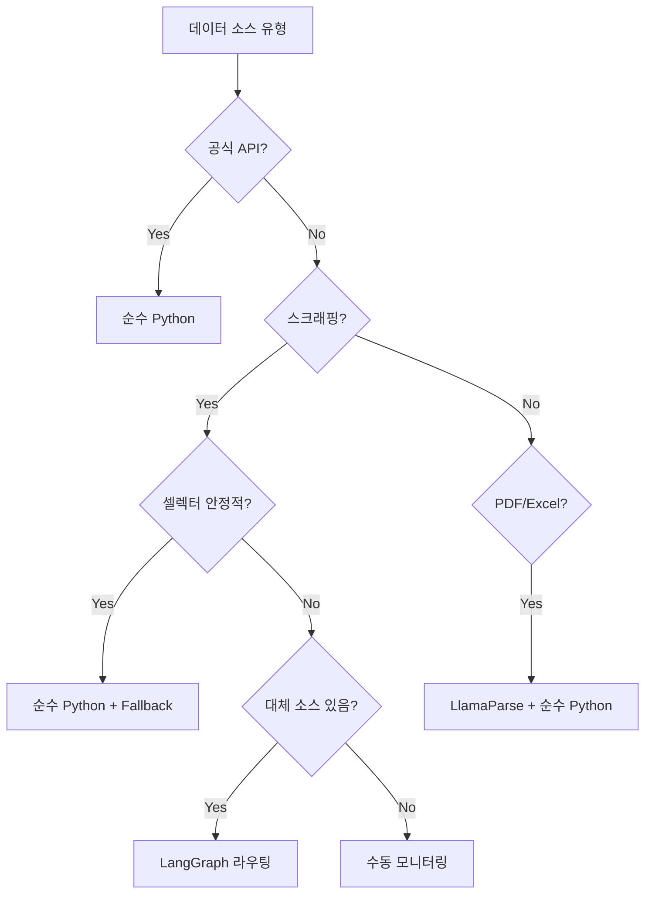

# 데이터 수집 전략 및 구현 가이드 (Bronze Layer)

## 문서 목적

`backend/docs/DATA_COLLECTION_SOURCES_GUIDE_V3.md`에 정의된 **50+ 출처**를 실제로 수집하여  
`raw_economic_data`, `raw_innovation_data`, `raw_people_data`, `raw_discourse_data`, `raw_opportunity_data`  
5개 테이블에 적재하는 **Bronze Layer 파이프라인**의 구현 전략을 정의합니다.

## 핵심 원칙

### 1. Bronze는 "원문 보존" — LLM 사용 최소화

**Bronze 목표**: 가공 없이 원천 데이터를 구조화된 형태로 저장  
→ LLM은 **비용·속도·재현성** 측면에서 부담이 크므로, **Silver 단계**로 미룹니다.

| 작업 | Bronze (수집) | Silver (정제) |
|------|---------------|---------------|
| HTML → JSON | 코드 (셀렉터) | - |
| API → DB 매핑 | 코드 (Pydantic) | - |
| 본문 요약 | ❌ 원문 그대로 | ✅ LLM |
| 산업 분류 | ❌ `source_type`만 | ✅ LLM |
| 중복 제거 | URL 해시 | ✅ LLM (의미 유사도) |

### 2. 셀렉터 우선순위 리스트 (Fallback Chain)

사이트 리뉴얼로 셀렉터가 깨지는 경우를 대비해 **3-5개 후보**를 미리 준비합니다.

```python
# 예시: The VC 투자 리스트
SELECTORS = {
    "title": [
        "h3.investment-title",
        "div.card-title",
        "span[data-field='company']"
    ],
    "amount": [
        "span.amount-krw",
        "div.investment-amount",
        "p:contains('억원')"
    ]
}

def extract_with_fallback(page, field: str):
    for selector in SELECTORS[field]:
        elements = page.query_selector_all(selector)
        if elements:
            return [el.text_content() for el in elements]
    return None  # 모두 실패 → 로그 남기고 알림
```

### 3. 수집 스케줄 분리

| 출처 유형 | 업데이트 주기 | 권장 스케줄 | 비고 |
|-----------|---------------|-------------|------|
| **공식 OpenAPI** (DART, HRD-Net) | 일 1회 | 새벽 3시 | 가장 안정적 |
| **RSS 피드** (Wowtale, 기술블로그) | 일 2회 | 3시, 15시 | 빠른 업데이트 |
| **스크래핑** (Wanted, 커뮤니티) | 일 1회 | 새벽 4시 | Rate limit 주의 |
| **정적 문서** (예산안 PDF) | 월 1회 | 매월 1일 5시 | 수동 트리거 가능 |

### 4. 노이즈 제거 전략 (2단계)

#### 4-1. 수집 시 (Bronze) — 키워드 필터

뉴스/블로그는 **검색어 리스트**로 범위를 먼저 좁힙니다.

```python
# config/keywords.py
CORE_KEYWORDS = [
    # 산업
    "AI", "블록체인", "바이오", "반도체", "클라우드",
    # 정책
    "K-Digital", "청년일자리", "스타트업지원",
    # 기술
    "LangChain", "FastAPI", "React", "Kubernetes"
]

# 네이버 뉴스 OpenAPI 호출 시
for keyword in CORE_KEYWORDS:
    results = naver_news_api.search(query=keyword, display=10)
    # raw_discourse_data 적재
```

#### 4-2. Silver 단계 — LLM 분류

Bronze 적재 후, 배치 작업으로 **관련성 점수** 계산

```python
# Silver 정제 (야간 배치)
for article in raw_discourse_data.filter(refined=False):
    prompt = f"""
    다음 기사가 "청년 커리어, 취업 트렌드, 기술 변화"와 관련 있나요?
    제목: {article.headline}
    본문 앞 200자: {article.content_body[:200]}
    
    답변: Yes 또는 No
    """
    answer = llm.invoke(prompt)
    if "Yes" in answer:
        article.is_relevant = True
        # refined_discourse 테이블로 이동
```

---

## 아키텍처: Hub-and-Spoke 패턴

`backend/domain/master`는 **5개 원천 테이블**의 수집 오케스트레이터입니다.

```
backend/domain/master/
├── hub/
│   ├── orchestrator/
│   │   └── bronze_scheduler.py      # APScheduler: 매일 새벽 3시 트리거
│   ├── repositories/
│   │   ├── economic_repo.py         # raw_economic_data CRUD
│   │   ├── innovation_repo.py
│   │   ├── people_repo.py
│   │   ├── discourse_repo.py
│   │   └── opportunity_repo.py
│   └── services/
│       └── deduplication.py         # URL 해시 기반 중복 체크
├── spokes/
│   ├── collectors/                  # 소스별 수집기 (Tool 역할)
│   │   ├── economic/
│   │   │   ├── thevc_collector.py
│   │   │   ├── wowtale_collector.py
│   │   │   └── dart_api_collector.py
│   │   ├── innovation/
│   │   │   ├── kipris_collector.py
│   │   │   └── arxiv_collector.py
│   │   ├── people/
│   │   │   ├── wanted_collector.py
│   │   │   └── saramin_collector.py
│   │   ├── discourse/
│   │   │   ├── namuwiki_collector.py
│   │   │   └── naver_news_collector.py
│   │   └── opportunity/
│   │       ├── hrdnet_collector.py
│   │       └── wevity_collector.py
│   └── infra/
│       ├── http_client.py           # aiohttp + retry + rate limit
│       ├── playwright_pool.py       # Playwright 브라우저 풀
│       └── selector_fallback.py     # 셀렉터 우선순위 처리
└── models/
    ├── bases/
    │   ├── raw_economic.py          # SQLAlchemy 모델
    │   ├── raw_innovation.py
    │   ├── raw_people.py
    │   ├── raw_discourse.py
    │   └── raw_opportunity.py
    └── states/
        └── collection_status.py     # LangGraph State (선택 사항)
```

---

## LangGraph 사용 여부 결정 트리



### LangGraph를 **사용하는 경우**

1. **다중 소스 라우팅**
   - "The VC 실패 시 → Wowtale로 대체"
   - "KIPRIS API 타임아웃 → NTIS로 우회"

2. **복잡한 상태 관리**
   - "페이지네이션 50페이지 돌다가 중단 → 다음날 이어서"
   - "수집 → 검증 → 실패 시 재시도 → 알림"

3. **실험적 소스**
   - 나무위키, Blind처럼 구조가 자주 바뀌는 곳

### LangGraph를 **사용하지 않는 경우**

1. **공식 OpenAPI**
   - DART, HRD-Net, K-Startup → 순수 `aiohttp` + Pydantic
2. **안정적 RSS**
   - feedparser 라이브러리로 충분
3. **정적 파일**
   - PDF/Excel → LlamaParse/openpyxl

---

## 구현 우선순위 (MVP 3단계)

### Phase 1: 공식 API (1주)

가장 안정적이고 법적 리스크 없는 소스부터 시작합니다.

| 출처 | 테이블 | 난이도 |
|------|--------|--------|
| DART OpenAPI | `raw_economic_data` | ⭐ |
| HRD-Net OpenAPI | `raw_opportunity_data` | ⭐ |
| K-Startup OpenAPI | `raw_opportunity_data` | ⭐ |
| 사람인 OpenAPI | `raw_people_data` | ⭐⭐ |

**목표**: 이 4개만 돌아가도 **경제·기회 영역의 30%** 커버 가능

### Phase 2: RSS + 안정적 스크래핑 (2주)

| 출처 | 테이블 | 난이도 |
|------|--------|--------|
| Wowtale RSS | `raw_economic_data` | ⭐ |
| 기업 기술블로그 RSS | `raw_innovation_data` | ⭐ |
| The VC | `raw_economic_data` | ⭐⭐ |
| Wanted (Playwright) | `raw_people_data` | ⭐⭐⭐ |

### Phase 3: 고난이도 소스 + LangGraph (3주)

| 출처 | 테이블 | 난이도 |
|------|--------|--------|
| 나무위키 | `raw_discourse_data` | ⭐⭐⭐⭐ |
| Blind | `raw_discourse_data` | ⭐⭐⭐⭐⭐ |
| 커뮤니티 (Theqoo, 디시) | `raw_discourse_data` | ⭐⭐⭐⭐ |

---

## 코드 예시

### 1) 순수 Python: DART OpenAPI

```python
# spokes/collectors/economic/dart_api_collector.py
import aiohttp
from datetime import datetime
from typing import List
from ...models.bases.raw_economic import RawEconomicData

class DartCollector:
    BASE_URL = "https://opendart.fss.or.kr/api"
    
    def __init__(self, api_key: str):
        self.api_key = api_key
    
    async def collect_investments(self, date: str) -> List[RawEconomicData]:
        """출자 공시 수집"""
        async with aiohttp.ClientSession() as session:
            params = {
                "crtfc_key": self.api_key,
                "corp_code": "",  # 전체
                "bgn_de": date,
                "pblntf_ty": "C001"  # 출자
            }
            async with session.get(f"{self.BASE_URL}/list.json", params=params) as resp:
                data = await resp.json()
                
                records = []
                for item in data.get("list", []):
                    records.append(RawEconomicData(
                        source_type="DART_INVESTMENT",
                        source_url=f"https://dart.fss.or.kr/dsaf001/main.do?rcpNo={item['rcpNo']}",
                        target_company_or_fund=item.get("corp_name"),
                        investment_amount=self._parse_amount(item.get("aqr_price")),
                        collected_at=datetime.utcnow()
                    ))
                return records
    
    def _parse_amount(self, text: str) -> int:
        # "1,000백만원" → 1000000000
        pass
```

### 2) Playwright + Fallback: The VC

```python
# spokes/collectors/economic/thevc_collector.py
from playwright.async_api import async_playwright
from ...infra.selector_fallback import extract_with_fallback

SELECTORS = {
    "company": ["h3.company-name", "div.title", "span[data-field='name']"],
    "amount": ["span.amount", "div.funding-size"]
}

class TheVCCollector:
    URL = "https://thevc.kr/browse/investments"
    
    async def collect(self):
        async with async_playwright() as p:
            browser = await p.chromium.launch(headless=True)
            page = await browser.new_page()
            await page.goto(self.URL)
            
            companies = extract_with_fallback(page, "company", SELECTORS["company"])
            amounts = extract_with_fallback(page, "amount", SELECTORS["amount"])
            
            if not companies:
                raise CollectionError("All selectors failed for The VC")
            
            # raw_economic_data 적재
            await browser.close()
```

### 3) LangGraph: 다중 소스 라우팅

```python
# hub/orchestrator/economic_graph.py
from langgraph.graph import StateGraph, END

def should_fallback(state):
    return "error" in state and state["source"] == "thevc"

graph = StateGraph()
graph.add_node("collect_thevc", collect_thevc_node)
graph.add_node("collect_wowtale", collect_wowtale_node)  # 대체

graph.add_edge("collect_thevc", END)
graph.add_conditional_edges(
    "collect_thevc",
    should_fallback,
    {
        True: "collect_wowtale",
        False: END
    }
)
```

---

## 모니터링 및 알림

### 1. 수집 실패 감지

```python
# hub/services/monitoring.py
from loguru import logger

async def collect_with_retry(collector, max_retries=3):
    for attempt in range(max_retries):
        try:
            data = await collector.collect()
            logger.info(f"{collector.__class__.__name__} 성공: {len(data)}건")
            return data
        except Exception as e:
            logger.error(f"{collector.__class__.__name__} 실패 (시도 {attempt+1}/{max_retries}): {e}")
            if attempt == max_retries - 1:
                # Slack/Discord 알림
                await send_alert(f"❌ {collector.__class__.__name__} 최종 실패")
            await asyncio.sleep(2 ** attempt)  # 지수 백오프
    return []
```

### 2. 일일 대시보드

```sql
-- 매일 새벽 수집 후 집계
SELECT 
    source_type,
    COUNT(*) as count,
    MAX(collected_at) as last_collected
FROM raw_economic_data
WHERE collected_at >= CURRENT_DATE
GROUP BY source_type;
```

---

## 다음 단계

1. **Phase 1 구현** (이번 주)
   - `dart_api_collector.py` 작성
   - `bronze_scheduler.py`에 APScheduler 등록
   - 로컬에서 수동 실행 → DB 확인

2. **Silver 설계** (다음 주)
   - `backend/domain/master/docs/SILVER_REFINEMENT_STRATEGY.md` 작성
   - LLM 기반 분류·요약 파이프라인

3. **Gold 설계** (2주 후)
   - 크로스오버 패턴, 인과 관계 추론

---

## 관련 문서

- `backend/docs/DATA_COLLECTION_SOURCES_GUIDE_V3.md` — 수집 출처 목록
- `backend/docs/erd.md` — Bronze Layer 테이블 DDL
- `backend/docs/BACKEND_ARCHITECTURE_BLUEPRINT.md` — 전체 아키텍처
